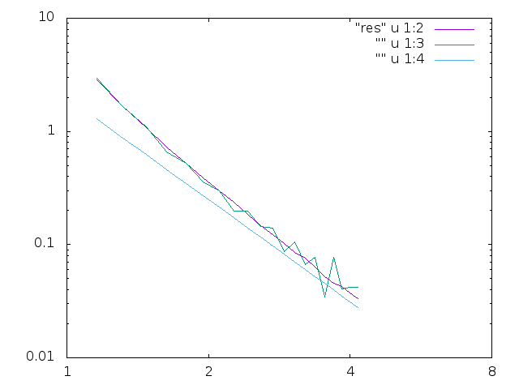

#fin2

PHYS 2200, Final exam part II

The interaction energy between two cubes is dependent on the distance between them. To find potential energy, we have integrated the expression using three methods: the GSL vegas monte carlo integrator, a home made monte carlo integrator, and the dipole approximation. We have timed the home made integrator as well as the GSL integrator. The GSL integrator took an average of 217.6 seconds to run, and the home made 14.61; however, the GSL integrator was much more precise. In order to reach the same level of precision on the home made integrator, the number of steps would be increased by ~190, making the runtime ~.8 hours. A graph of the output of each integral is plotted below. 

